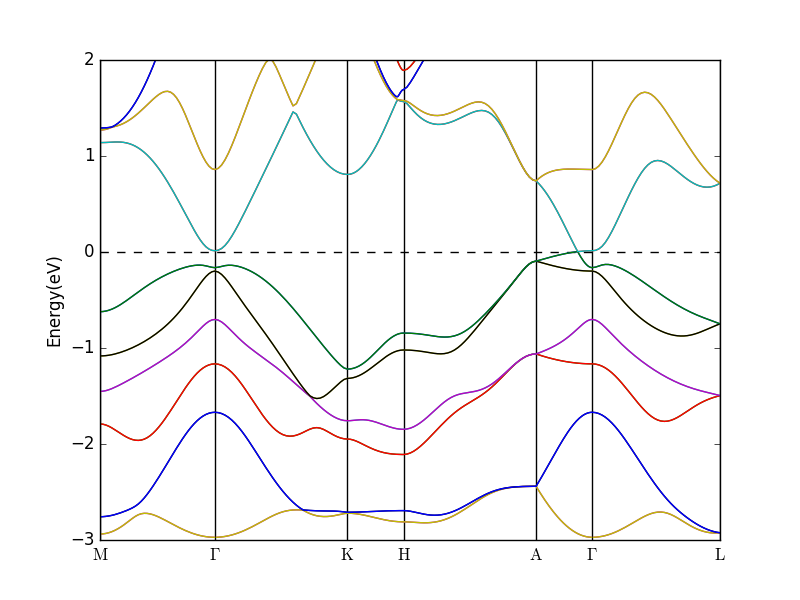

# VASP-band-plotter

Simple tool to draw beautiful band structure from VASP output.

## Requirement
* python2.7 / python3
* pandas
* matplotlib

## Preparation
You need to prepare some of the files needed / generated by VASP in the same working directory:  
*`KPOINTS, EIGENVAL, OUTCAR`*

**`KPOINTS` should spectify k vectors in reciprocal space**  
For example,
```
k-points along high symmetry lines
40
Line-mode
reciprocal
  0.5 0 0 ! M
  0 0 0 ! gamma

  0 0 0 ! gamma
  0.333333 0.333333 0.0000 ! K
```
**Also, `genCSV.py` takes the first character of `M, gamma, and K`, "M, G, K"  
and `genBand.py` handles "G" to the symbol $\Gamma$.**

## Execution
```bash
python genCSV.py
```
will create `band.csv` which is needed by `genBand.py`.

```bash
python genBand.py
```
will plot the band structure.

## Example: Na3Bi

